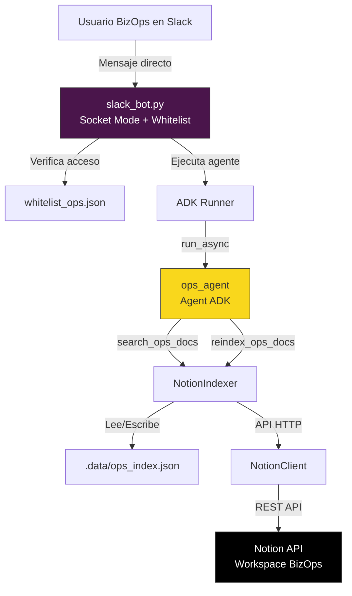
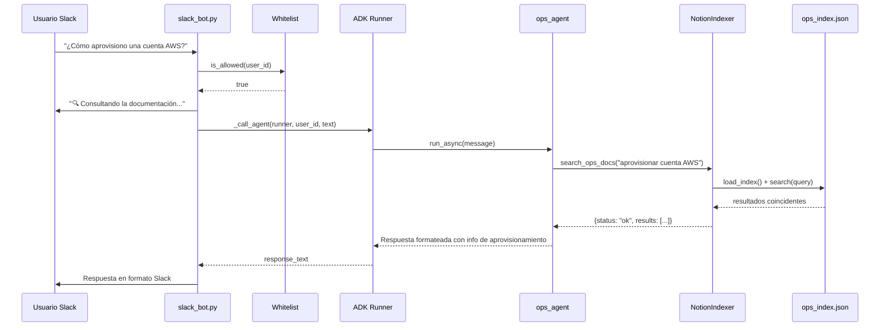
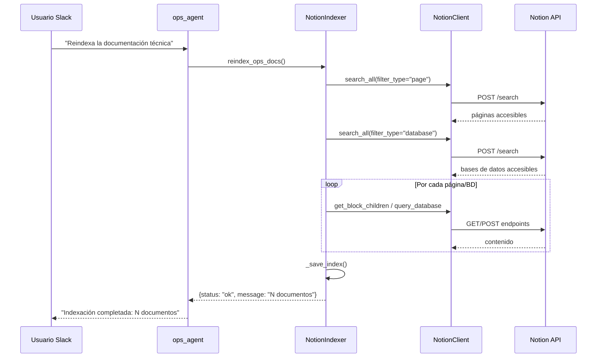

# Documento de Diseño: Notion-Slack Ops Agent

## Visión General

Este agente conecta el workspace de Notion del equipo de BizOps con Slack, permitiendo que los miembros del equipo consulten información técnica y operacional directamente desde Slack. El agente sigue el mismo patrón arquitectónico que los agentes AWS y GCP existentes: un agente ADK con herramientas de búsqueda y reindexación sobre un índice JSON local generado a partir de Notion, expuesto a través del bot de Slack compartido con control de acceso por lista blanca.

El agente está especializado en consultas técnicas y operacionales: aprovisionamiento de AWS/GCP, facturación, cuentas, soporte técnico, procesos operacionales y documentación de servicios cloud. Utiliza el módulo `notion_shared` existente para la integración con Notion y `slack_bot.py` para la integración con Slack, sin necesidad de modificar ninguno de estos módulos compartidos.

## Arquitectura



## Diagrama de Secuencia: Consulta Técnica/Operacional



## Diagrama de Secuencia: Reindexación



## Componentes e Interfaces

### Componente 1: ops_agent (agents/ops_agent/agent.py)

**Propósito**: Agente ADK especializado en consultas técnicas y operacionales del equipo de BizOps. Recibe preguntas en lenguaje natural y utiliza herramientas para buscar en la documentación de Notion del área de operaciones.

**Interfaz**:
```python
# Herramienta de búsqueda
def search_ops_docs(query: str) -> dict:
    """Busca información técnica y operacional en el índice de Notion.
    
    Returns:
        {"status": "ok", "results": [{"title", "type", "content", "url"}]}
        o {"status": "no_results", "message": "..."}
    """
    ...

# Herramienta de reindexación
def reindex_ops_docs() -> dict:
    """Reindexa toda la documentación técnica desde Notion.
    
    Returns:
        {"status": "ok", "message": "Indexación completada: N documentos."}
        o {"status": "error", "message": "..."}
    """
    ...

# Definición del agente
agent = Agent(
    model="gemini-2.0-flash",
    name="ops_agent",
    description="Agente experto en información técnica y operacional de AWS/GCP para el equipo de BizOps.",
    instruction="...",  # Instrucciones especializadas para operaciones
    tools=[search_ops_docs, reindex_ops_docs],
)
```

**Responsabilidades**:
- Interpretar consultas del equipo de BizOps sobre aprovisionamiento, facturación, cuentas, soporte, procesos operacionales
- Buscar información relevante en el índice local de Notion
- Sintetizar respuestas claras y concisas en español
- Solicitar reindexación cuando se le pida
- Filtrar contenido relevante en documentos grandes (mismo patrón que aws_agent)

### Componente 2: run_ops_bot.py

**Propósito**: Script de arranque que configura y lanza el bot de Slack para el agente ops.

**Interfaz**:
```python
# Punto de entrada
run_bot(
    bot_token=os.getenv("SLACK_BOT_TOKEN_OPS", ""),
    app_token=os.getenv("SLACK_APP_TOKEN_OPS", ""),
    whitelist_path=".data/whitelist_ops.json",
    adk_agent=agent,
    bot_name="Ops Info Bot",
)
```

**Responsabilidades**:
- Cargar variables de entorno específicas del agente ops
- Importar el agente desde `agents.ops_agent.agent`
- Invocar `run_bot()` del módulo compartido `slack_bot.py`

### Componente 3: __init__.py (agents/ops_agent/__init__.py)

**Propósito**: Módulo de inicialización que sigue la convención de agentes ADK.

**Interfaz**:
```python
from .agent import agent
```

### Componentes Existentes Reutilizados (sin modificación)

| Componente | Ubicación | Uso |
|---|---|---|
| NotionIndexer | `notion_shared/indexer.py` | Indexación y búsqueda por keywords en JSON local |
| NotionClient | `notion_shared/notion_client.py` | Cliente HTTP para Notion API |
| text_extractor | `notion_shared/text_extractor.py` | Extracción de texto de bloques, páginas y filas de BD |
| slack_bot | `slack_bot.py` | Bot Slack con Socket Mode, whitelist, admin commands, ADK Runner |

## Modelos de Datos

### Índice Ops (.data/ops_index.json)

```python
# Estructura del archivo de índice (generada por NotionIndexer)
{
    "indexed_at": "2025-01-15T10:30:00",  # ISO timestamp
    "total_documents": 120,
    "documents": [
        {
            "id": "uuid-de-notion",
            "type": "page" | "database",
            "title": "Proceso de Aprovisionamiento AWS",
            "content": "Contenido extraído en texto plano...",
            "url": "https://notion.so/...",
            "last_edited": "2025-01-14T08:00:00"
        }
    ]
}
```

**Reglas de validación**:
- `id` debe ser un UUID válido de Notion
- `type` solo puede ser "page" o "database"
- `content` no debe estar vacío para documentos indexados
- El archivo se regenera completamente en cada reindexación

### Resultado de Búsqueda (retorno de search_ops_docs)

```python
# Caso exitoso
{"status": "ok", "results": [
    {
        "title": str,      # Título del documento
        "type": str,        # "page" o "database"
        "content": str,     # Contenido truncado (máx ~2000 chars)
        "url": str,         # URL de Notion (opcional en respuesta)
    }
]}

# Sin resultados
{"status": "no_results", "message": str}
```

### Variables de Entorno Requeridas

```bash
# Token de integración de Notion para el workspace de BizOps
NOTION_TOKEN_OPS=ntn_...

# Tokens del bot de Slack para el agente ops
SLACK_BOT_TOKEN_OPS=xoxb-...
SLACK_APP_TOKEN_OPS=xapp-...

# Existentes (compartidos)
SLACK_ADMIN_USERS=U05R4UAD1RT,...  # Admins que gestionan whitelist
GOOGLE_API_KEY=...                  # API key de Gemini
```

## Manejo de Errores

### Escenario 1: Índice vacío o inexistente

**Condición**: El usuario consulta pero `ops_index.json` no existe o está vacío.
**Respuesta**: `search_ops_docs` devuelve `{"status": "no_results", "message": "No encontré información relevante. Puede que el índice esté vacío. Ejecuta primero el indexador."}`.
**Recuperación**: El agente sugiere al usuario ejecutar la reindexación.

### Escenario 2: Token de Notion inválido o expirado

**Condición**: `NOTION_TOKEN_OPS` es inválido o la integración fue revocada.
**Respuesta**: `reindex_ops_docs` captura la excepción HTTP y devuelve `{"status": "error", "message": "401 Unauthorized..."}`.
**Recuperación**: El agente informa al usuario del error. Se debe verificar el token en `.env`.

### Escenario 3: Timeout del agente ADK

**Condición**: La ejecución del agente supera los 120 segundos (timeout en `_call_agent`).
**Respuesta**: `slack_bot.py` captura la excepción y envía "❌ Hubo un error al procesar tu pregunta."
**Recuperación**: El usuario puede reintentar con una consulta más específica.

### Escenario 4: Usuario sin acceso

**Condición**: El usuario no está en la whitelist ni es admin.
**Respuesta**: Se muestra el botón "🔑 Solicitar acceso" (flujo existente en `slack_bot.py`).
**Recuperación**: Un admin aprueba o rechaza la solicitud vía botones interactivos.

## Estrategia de Testing

### Testing Manual

- Verificar que el agente responde correctamente a consultas técnicas/operacionales típicas:
  - "¿Cómo aprovisiono una cuenta AWS?"
  - "¿Cuál es el proceso de facturación de GCP?"
  - "¿Cómo abro un ticket de soporte?"
  - "¿Qué documentación tenemos sobre licencias?"
- Verificar que la reindexación funciona correctamente
- Verificar el flujo de acceso (whitelist, solicitud, aprobación)

### Testing de Integración

- Verificar que `NotionIndexer` indexa correctamente el workspace de BizOps
- Verificar que `search_ops_docs` devuelve resultados relevantes para queries técnicas/operacionales
- Verificar que el bot de Slack arranca sin errores con las variables de entorno correctas

### Testing de Búsqueda

- Verificar que documentos grandes (>4000 chars) se filtran por relevancia de keywords
- Verificar que se limitan los resultados a 5 para no saturar el contexto del LLM
- Verificar que la búsqueda funciona con términos en español

## Consideraciones de Rendimiento

- **Modelo Gemini**: Se recomienda `gemini-2.0-flash` por su balance entre velocidad y calidad, consistente con el agente GCP. El agente ops no requiere el razonamiento avanzado de `gemini-2.5-pro` ya que las consultas son principalmente de recuperación de información.
- **Truncado de contenido**: Los resultados de búsqueda se truncan a ~2000 caracteres por documento para mantener el contexto del LLM manejable.
- **Filtrado por keywords**: Para documentos grandes (BDs con muchas filas), se filtran las líneas más relevantes antes de enviarlas al LLM (patrón del aws_agent).
- **Límite de resultados**: Máximo 5 resultados por búsqueda para no saturar la ventana de contexto.

## Consideraciones de Seguridad

- **Tokens de Notion**: Almacenados en `.env`, nunca en código fuente. El `.gitignore` ya excluye `.env`.
- **Control de acceso**: La whitelist por usuario de Slack garantiza que solo miembros autorizados del equipo de BizOps acceden a la información.
- **Datos sensibles**: La información técnica y operacional es sensible. El índice JSON local (`.data/ops_index.json`) debe estar excluido del repositorio (`.data/` ya está en `.gitignore`).
- **Admins**: Solo los usuarios en `SLACK_ADMIN_USERS` pueden gestionar la whitelist.

## Propiedades de Corrección

*Una propiedad es una característica o comportamiento que debe cumplirse en todas las ejecuciones válidas de un sistema, esencialmente una declaración formal sobre lo que el sistema debe hacer. Las propiedades sirven como puente entre especificaciones legibles por humanos y garantías de corrección verificables por máquina.*

### Propiedad 1: Búsqueda devuelve resultados formateados

*Para cualquier consulta válida en el índice ops, los resultados devueltos SHALL incluir hasta 5 documentos, cada uno con título, tipo y contenido truncado a máximo 2000 caracteres.*

**Valida: Requisitos 1.2, 12.2, 12.3**

### Propiedad 2: Filtrado de documentos grandes

*Para cualquier documento con más de 4000 caracteres y una consulta de búsqueda, el contenido mostrado SHALL contener solo las líneas más relevantes según los términos de búsqueda.*

**Valida: Requisitos 1.4, 12.4**

### Propiedad 3: Índice contiene metadatos requeridos

*Para cualquier índice generado, cada documento SHALL incluir: ID de Notion, tipo, título, contenido extraído, URL y fecha de última edición. El índice SHALL incluir timestamp de indexación y número total de documentos.*

**Valida: Requisitos 2.5**

### Propiedad 4: Reindexación reemplaza completamente

*Para cualquier reindexación, todos los documentos anteriores SHALL ser reemplazados completamente. Si se reindexan N documentos nuevos, el índice SHALL contener exactamente N documentos (no es incremental).*

**Valida: Requisitos 2.4**

### Propiedad 5: Notificación a todos los administradores

*Para cualquier solicitud de acceso, todos los usuarios en SLACK_ADMIN_USERS SHALL recibir una notificación con botones para aprobar o rechazar.*

**Valida: Requisitos 3.2**

### Propiedad 6: Aprobación añade a whitelist

*Para cualquier usuario que solicita acceso y es aprobado por un administrador, ese usuario SHALL ser añadido a la whitelist y podrá consultar el agente sin restricciones.*

**Valida: Requisitos 3.3, 3.5**

### Propiedad 7: Rechazo notifica al usuario

*Para cualquier solicitud de acceso rechazada, el usuario SHALL recibir una notificación del rechazo.*

**Valida: Requisitos 3.4**

### Propiedad 8: Administradores bypasean whitelist

*Para cualquier usuario en SLACK_ADMIN_USERS, podrá consultar el agente sin necesidad de estar en la whitelist.*

**Valida: Requisitos 3.6**

### Propiedad 9: Comando lista muestra todos los usuarios

*Para cualquier estado de la whitelist, el comando `admin lista` SHALL mostrar todos los usuarios actualmente en la whitelist.*

**Valida: Requisitos 4.1**

### Propiedad 10: Comando añadir agrega usuarios

*Para cualquier usuario mencionado en el comando `admin añadir @usuario`, ese usuario SHALL ser añadido a la whitelist.*

**Valida: Requisitos 4.2**

### Propiedad 11: Comando quitar elimina usuarios

*Para cualquier usuario mencionado en el comando `admin quitar @usuario`, ese usuario SHALL ser eliminado de la whitelist.*

**Valida: Requisitos 4.3**

### Propiedad 12: Solo administradores ejecutan comandos admin

*Para cualquier usuario que no está en SLACK_ADMIN_USERS, intentar ejecutar comandos admin SHALL ser rechazado con un mensaje de permiso denegado.*

**Valida: Requisitos 4.4**

### Propiedad 13: Cambios de whitelist persisten

*Para cualquier cambio en la whitelist (añadir, quitar), el cambio SHALL persistirse en `.data/whitelist_ops.json` y ser recuperable después de reiniciar el bot.*

**Valida: Requisitos 4.5**

### Propiedad 14: Conversión Markdown a Slack

*Para cualquier texto en formato Markdown, la conversión a formato Slack SHALL convertir correctamente: **negrita** → *negrita*, __negrita__ → *negrita*, ### heading → *heading*, manteniendo `código` y _cursiva_ sin cambios.*

**Valida: Requisitos 7.2**

### Propiedad 15: Respuestas sin referencias de Notion

*Para cualquier respuesta del agente, SHALL no contener URLs de Notion (excepto URLs de dashboards operacionales explícitamente mencionadas en los documentos) ni referencias a fuentes de Notion.*

**Valida: Requisitos 7.5**

### Propiedad 16: Acceso denegado sin revelar información

*Para cualquier usuario no autorizado que intenta acceder, el bot SHALL mostrar un mensaje de acceso denegado sin revelar información sobre qué documentos existen en el índice.*

**Valida: Requisitos 8.5, 13.4**

### Propiedad 17: Archivos de datos se crean correctamente

*Para cualquier ejecución del agente, SHALL crear/actualizar los archivos `.data/ops_index.json` y `.data/whitelist_ops.json` con contenido válido.*

**Valida: Requisitos 10.2**

### Propiedad 18: Búsquedas usan índice local

*Para cualquier búsqueda, el agente SHALL usar el archivo `.data/ops_index.json` local sin conectarse a Notion API en cada búsqueda.*

**Valida: Requisitos 12.5**

### Propiedad 19: Respuestas dentro del timeout

*Para cualquier consulta válida, el agente SHALL responder en menos de 120 segundos.*

**Valida: Requisitos 12.1**

## Dependencias

| Dependencia | Uso | Estado |
|---|---|---|
| `google-adk` | Framework de agentes (Agent, Runner, InMemorySessionService) | Existente |
| `google-genai` | SDK de Gemini (types.Content, types.Part) | Existente |
| `slack-bolt` | Framework de Slack (App, SocketModeHandler) | Existente |
| `python-dotenv` | Carga de variables de entorno | Existente |
| `requests` | Cliente HTTP para Notion API | Existente |
| `notion_shared` | Módulo compartido de Notion (indexer, client, extractor) | Existente |
| `slack_bot.py` | Módulo compartido del bot de Slack | Existente |

No se requieren dependencias nuevas. El agente ops reutiliza toda la infraestructura existente.
